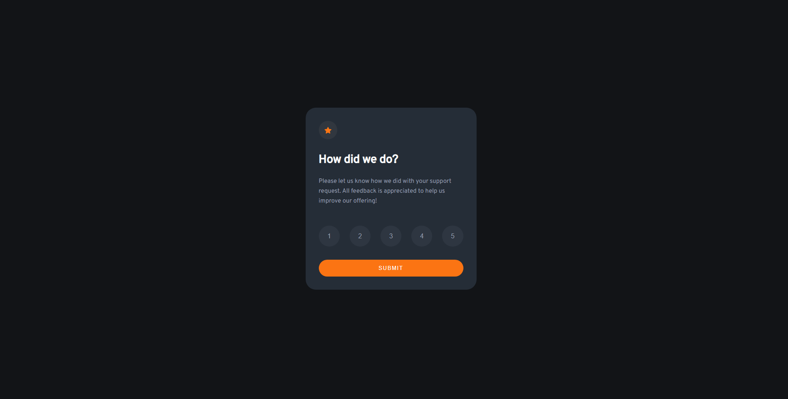

# Frontend Mentor - Interactive rating component solution

This is a solution to the [Interactive rating component challenge on Frontend Mentor](https://www.frontendmentor.io/challenges/interactive-rating-component-koxpeBUmI). Frontend Mentor challenges help you improve your coding skills by building realistic projects. 

## Table of contents

- [Overview](#overview)
  - [The challenge](#the-challenge)
  - [Screenshot](#screenshot)
  - [Links](#links)
- [My process](#my-process)
  - [Built with](#built-with)
  - [Useful resources](#useful-resources)
- [Author](#author)

## Overview

### The challenge

Users should be able to:

- View the optimal layout for the app depending on their device's screen size
- See hover states for all interactive elements on the page
- Select and submit a number rating
- See the "Thank you" card state after submitting a rating

### Screenshot

### Links

- Solution URL: [Add solution URL here](https://your-solution-url.com)
- Live Site URL: [Add live site URL here](https://your-live-site-url.com)

## My process

### Built with

- Semantic HTML5 markup
- CSS custom properties
- Flexbox
- CSS Grid
- JavaScript

### Useful resources

- [MDN aria-checked](https://developer.mozilla.org/en-US/docs/Web/Accessibility/ARIA/Attributes/aria-checked) - Used to change behaviour of a selected rating button. 
- [MDN aria role radio](https://developer.mozilla.org/en-US/docs/Web/Accessibility/ARIA/Roles/radio_role) - Used to create checkable buttons to display the ratings.

## Author

- GitHub - [@ManuGil22](https://github.com/ManuGil22)
- Frontend Mentor - [@ManuGil22](https://www.frontendmentor.io/profile/ManuGil22)

